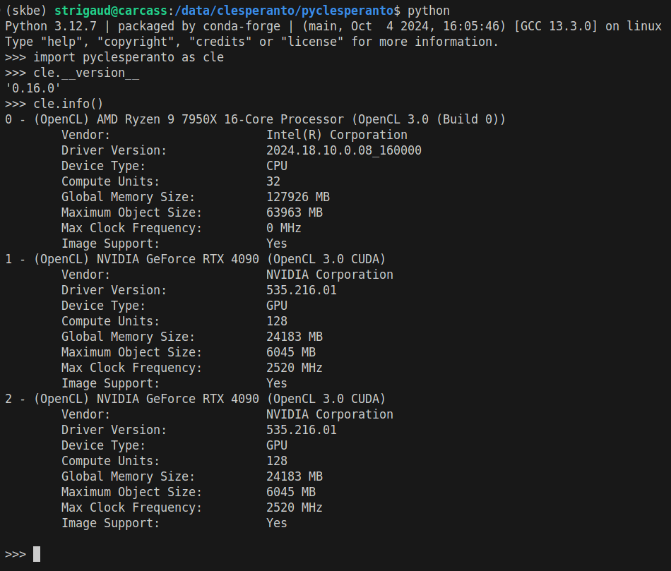
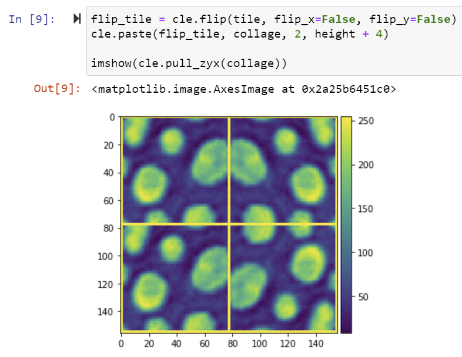
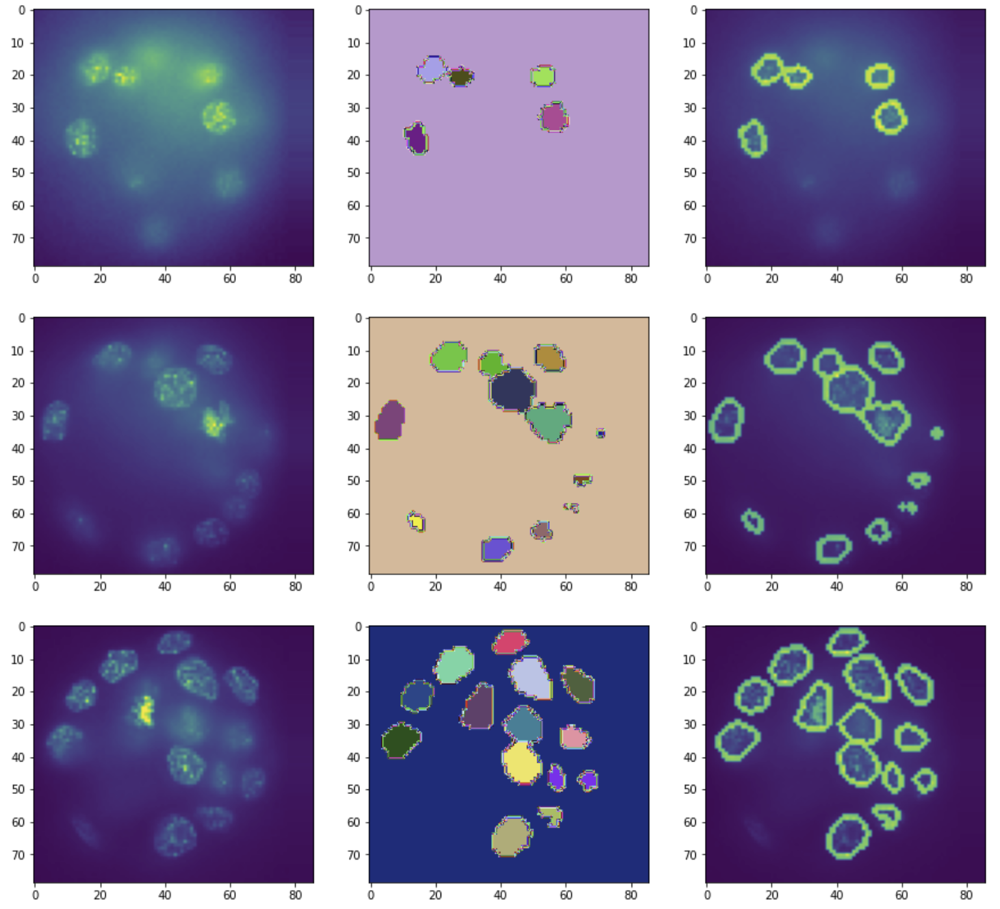
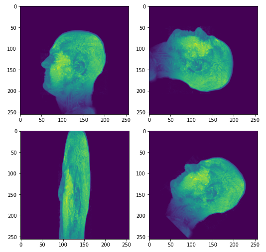
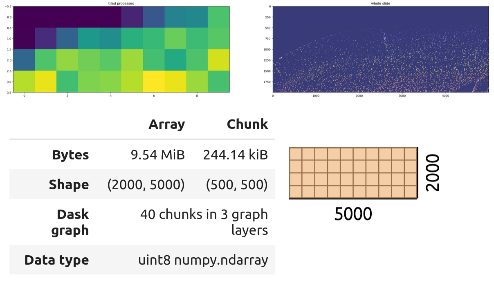

# pyclesperanto

[](https://forum.image.sc/tag/pyclesperanto)
[](https://pypi.org/project/pyclesperanto)
[](https://github.com/clEsperanto/pyclesperanto/blob/main/LICENSE)
[](https://en.wikipedia.org/wiki/Software_release_life_cycle#Beta)
[](https://github.com/clEsperanto/pyclesperanto/actions/workflows/build.yml)
[](https://codecov.io/gh/clesperanto/pyclesperanto)
[](https://doi.org/10.5281/zenodo.13853800)

__pyclesperanto__ is the python package of [clEsperanto] - a multi-language framework for GPU-accelerated image processing, compatible with [OpenCL](https://www.khronos.org/opencl/), [CUDA](https://developer.nvidia.com/cuda-zone), and [Metal](https://developer.apple.com/metal/).

We mostly use it in the life sciences for analysing 3- and 4-dimensional microsopy data, e.g. as we face it developmental biology when segmenting cells and studying their individual properties as well as properties of compounds of cells forming tissues.


## Installation, Documentation, and Uses

To install pyclesperanto from `pip`:
```bash
pip install pyclesperanto[all]
```

Full documentation, examples and API references [here](https://clesperanto-doc.readthedocs.io/en/latest/docs/pyclesperanto/index.html) 📚

If you encountering any difficulties or have questions we encourage you to raise them on the [image.sc forum] under the tag `clesperanto`,
or to open a [github issue](https://github.com/clEsperanto/pyclesperanto/issues).

> [!NOTE]
> If transitioning from `pyclesperanto_prototype`, check out the [transition notes](https://github.com/clEsperanto/pyclesperanto-transition-notes/blob/main/transition_notes.md) to help you update your code.


## __Code Example__

```python
import pyclesperanto as cle
from skimage.io import imread, imsave

# initialize GPU
device = cle.select_device()
print("Used GPU: ", device)

image = imread("https://samples.fiji.sc/blobs.png?raw=true")

# push image to device memory
input_image = cle.push(image)

# process the image
inverted = cle.subtract_image_from_scalar(input_image, scalar=255)
blurred = cle.gaussian_blur(inverted, sigma_x=1, sigma_y=1)
binary = cle.threshold_otsu(blurred)
labeled = cle.connected_components_labeling(binary)

# The maxmium intensity in a label image corresponds to the number of objects
num_labels = cle.maximum_of_all_pixels(labeled)

# print out result
print("Num objects in the image: " + str(num_labels))

# read image from device memory
output_image = cle.pull(labeled)
imsave("result.tif", output_image)
```

## __Examples & Demos__

<table border="0">
<tr><td>

</td><td>

- [Select a Backend](docs/demos/api/manage_backends.ipynb)
- [Choose a devices](docs/demos/api/select_devices.ipynb)
- [Host-Device memory transfer](docs/demos/api/push_pull_create.ipynb)
- [Process an array](docs/demos/api/process_image.ipynb)

</td></tr>

<tr><td>

</td><td>

- [Arrays manipulation](docs/demos/basics/array_manipulation.ipynb)
- [Arrays arithmetics](docs/demos/basics/array_arithmetics.ipynb)
- [Matrix arithmetics](docs/demos/basics/matrix_operations.ipynb)
- [Numpy compatibility](docs/demos/interoperability/numpy.ipynb)
- [Cupy and Torch interoperability](docs/demos/interoperability/cupy_torch.ipynb)

</td></tr>

<tr><td>

</td><td>

- [Histogram correction](docs/demos/examples/histogram_and_clahe.ipynb)
- [Denoising filters](docs/demos/examples/denoising_filters.ipynb)
- [Thresholding](docs/demos/examples/thresholding.ipynb)
- [Spot detection](docs/demos/examples/spot_detection.ipynb)
- [Template matching detection](docs/demos/examples/template_matching_detection.ipynb)
- [Edge and Ridge filtering](docs/demos/examples/edge_and_ridge_filters.ipynb)

</td></tr>

<tr><td>

</td><td>

- [Voronoi-Otsu segmentation](docs/demos/examples/voronoi_otsu_labeling.ipynb)
- [Membrane segmentation](docs/demos/examples/membrane_segmentation_2d.ipynb)
- [3D nuclei segmentation](docs/demos/examples/Segmentation_3D.ipynb)
- [Chan-Vese segmentation](docs/demos/examples/chan_vese_segmentation.ipynb)
- [Labels quantifications](docs/demos/basics/label_statistics.ipynb)
- [Parametrical maps](docs/demos/examples/parametric_maps.ipynb)
- [Map quantifications](docs/demos/examples/map_quantification.ipynb)
- [Filter nuclei by intensity](docs/demos/examples/identify_nuclei_by_intensity.ipynb)

</td></tr>

<tr><td>

</td><td>

- [Image transformation](docs/demos/examples/affine_transforms.ipynb)
- [FFT Convolution and Deconvolution](docs/demos/examples/image_deconvolution.ipynb)
- [Multi-GPU and tile processing with Dask docs](demos/examples/multi-gpu_tile_processing_with_dask.ipynb)
- [Ask Bia-Bob docs](demos/interoperability/biabob-example.ipynb)

</td></tr>

</table>

More usage and example can be found as notebooks in the [tutorial section](https://clesperanto-doc.readthedocs.io/en/latest/docs/pyclesperanto/tutorials.html) of the documentation as well as in the [docs/demos](https://github.com/clEsperanto/pyclesperanto/tree/main/docs/demos) folder of the repository.

# __Contributing and Feedback__

[clEsperanto](https://github.com/clEsperanto) is developed in the open because we believe in the [open source community](https://clij.github.io/clij2-docs/community_guidelines).
Feel free to drop feedback as [github issue](https://github.com/clEsperanto/pyclesperanto/issues) or via [image.sc](https://image.sc). Contributions, of any kind, are very welcome. Feel free to reach out to us. And if you liked our work, star the repository, share it with your friends, and use it to make cool stuff!

## Acknowledgements

We acknowledge support by the Deutsche Forschungsgemeinschaft under Germany’s Excellence Strategy (EXC2068) Cluster of Excellence Physics of Life of TU Dresden and by the [Institut Pasteur, Paris](https://www.pasteur.fr/en). This project has been made possible in part by grant number 2021-237734 ([GPU-accelerating Fiji and friends using distributed CLIJ, NEUBIAS-style, EOSS4](https://chanzuckerberg.com/eoss/proposals/gpu-accelerating-fiji-and-friends-using-distributed-clij-neubias-style/)) from the Chan Zuckerberg Initiative DAF, an advised fund of the Silicon Valley Community Foundation, and by support from the French National Research Agency via the [France BioImaging research infrastructure](https://france-bioimaging.org/) (ANR-24-INBS-0005 FBI BIOGEN).

[clEsperanto]: http://clesperanto.net/
[OpenCL kernels]: https://github.com/clEsperanto/clij-opencl-kernels/tree/clesperanto_kernels
[CLIJ]: http://clij.github.io/
[CLIc]: https://github.com/clEsperanto/CLIc
[community guidelines]: https://clij.github.io/clij2-docs/community_guidelines
[github issue]: https://github.com/clEsperanto/pyclesperanto/issues
[image.sc forum]: https://forum.image.sc/tag/clesperanto/1556
[PyBind11]: https://github.com/pybind
[documentation]: https://clesperanto-doc.readthedocs.io/en/latest/docs/pyclesperanto/index.html
